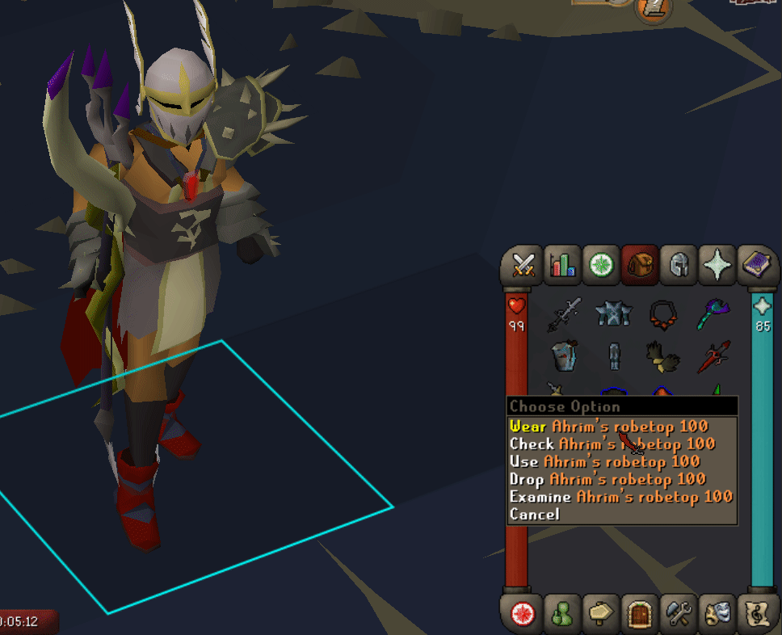
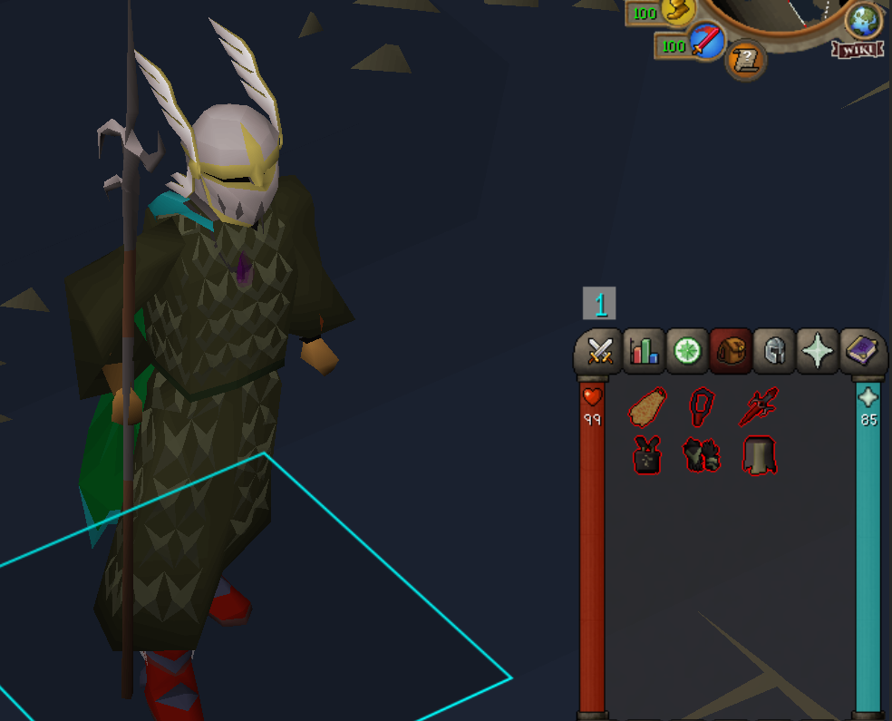
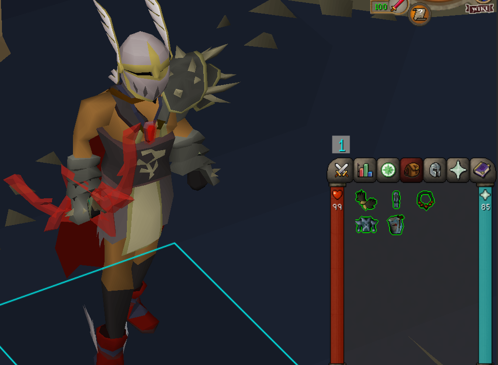
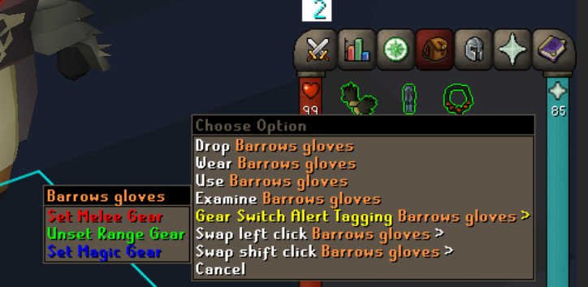
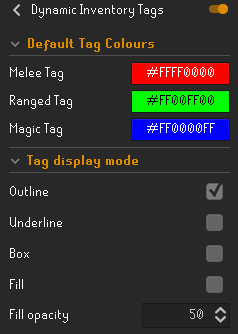

# Dynamic Inventory Tags
A plugin to tag gear items that are missing from your current switch. Depending on the weapon type equipped, melee/range/magic gear gets highlighted accordingly if they aren't equipped.
To set if an item is meant to be defined as Melee gear, Range gear, or Magic gear... shift + right click the item and set it manually.

## Example

## Screenshots

## TODO

-[ ] Enable automatic gear item tagging so that gear items are automatically identified by their respective types (this can still be altered manually if a range gear for example is purposefully being used alongside melee gear for example in some future PvM content etc)

-[ ] Add profiles so that you can set specific gear item type based on specific PvM content
