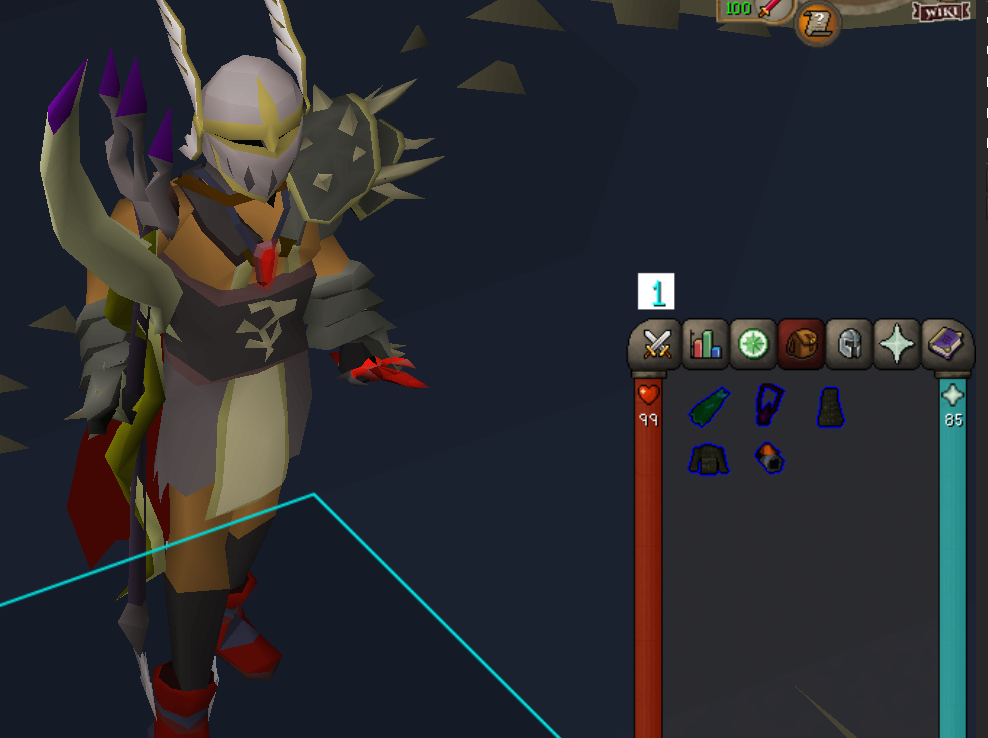

# Dynamic Inventory Tags (v1.1.1)

A plugin to tag gear items that are missing from your current switch. Depending on the weapon type equipped, melee/range/magic gear gets highlighted accordingly if they aren't equipped.
To set if an item is meant to be defined as Melee gear, Range gear, or Magic gear... shift + right click the item and set it manually.

### What's New:
- Add tagging delay option
- [Added Panel](#panel)
- [Added the ability to add items by searching for them. No need to have them equipped or in inventory anymore!](#searching-mechanism)
- Added check to ensure that items being added are equippable items (can be disabled in config if you wish to set tags for unequippable item for some reason)
- Ability to import/export profiles! (Right-click any profile to export and use the "Import profile from clipboard" button at the bottom of the panel to import)

## Example

## Panel

## Searching Mechanism
You need to be logged in to be able to use the search menu!

## Screenshots

## TODO

- [ ] Enable automatic gear item tagging so that gear items are automatically identified by their respective types (this can still be altered manually if a range gear for example is purposefully being used alongside melee gear for example in some future PvM content etc)

- [x] Add profiles so that you can set specific gear item type based on specific PvM content
